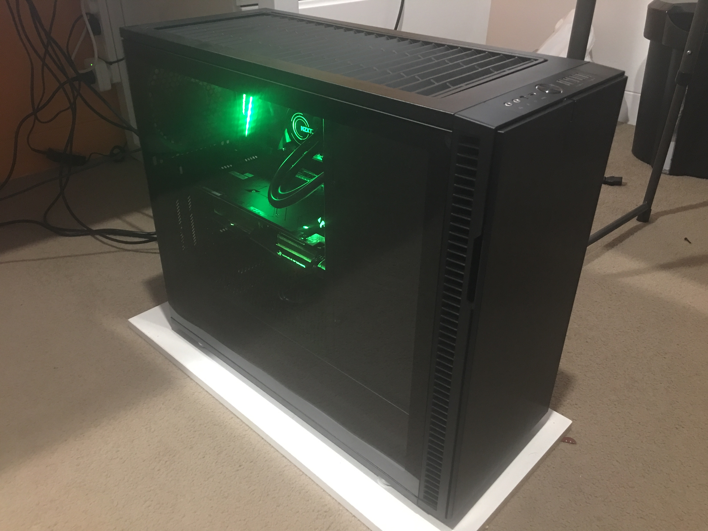
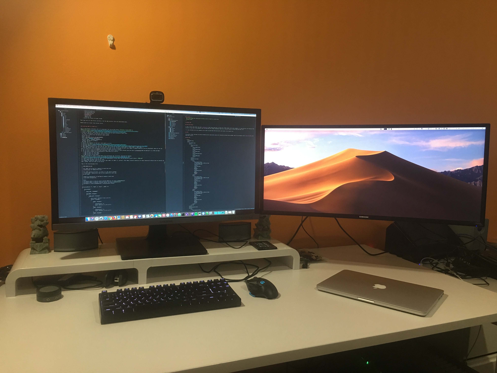
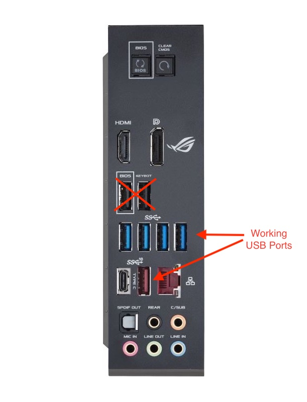
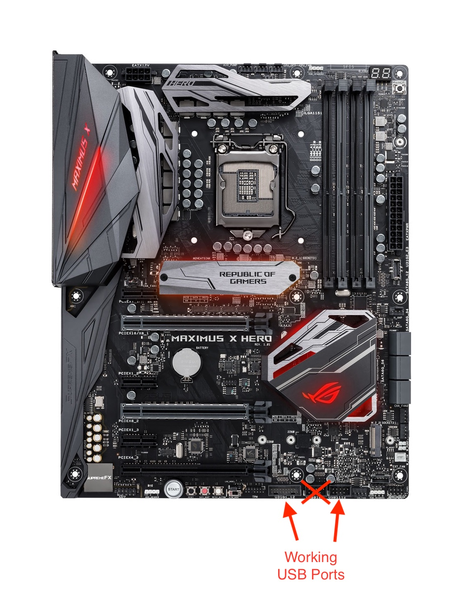

## Asus Maximus X Hero Z370 - i7 8700K - RX 580 Hackintosh Dual Boot macOS Mojave 10.14.0 & Windows 10




### Hardware

Motherboard: Asus Maximus X Hero Z370 Motherboard  
Processor: Intel i7 8700k  
GPU: Asus ROG Strix Radeon RX 580 TOP edition 8GB  
CPU Cooler: NZXT Kraken X52  
PC Case: Define R6 USB-C Blackout – TG  
Storage: Samsund SSD 860 EVO M.2 SATA 1TB (MZ-N6E1T0BW) (This is My macOS HD)  
Storage: Samsung SSD 860 Evo 500GB 2.5" (MZ-76E500BW) (This is my Windows 10 HD)  
Storage: 4 x 4TB HDD  
PSU: Seasonic SSR-750GD2 Prime Ultra 80+ Gold Fully Modular Power Supply  

Notes: 
- I would probably choose the Corsair RM750X PSU next time as the cables with the Seasonic are not covered, and I think the cables on the RM750X would have looked better.
- I connected the NZXT Kraken X52 PMW cable to the AIO header on the Asus motherboard, then I made sure that it was set to 100%. When it was connected to the CPU header the pump was not getting enough power. I also connected the two fans on the radiator directly to the CPU and CPU OPT headers instead of to the cable coming from the Kraken X52, this is so that the motherboard can control the fan speed, as in macOS, the software that controls the Kraken X52 does not work. I also logged into Windows and set the LED to the desired colour and set the pump speed to 2000rmp.
- I also set the LEDs for the motherboard in Windows using the Asus software, I set a static colour that persists after shutdown etc... I also turned off the LEDs when the PC is shutdown through the Asus software in Windows.
- I installed Windows 10 to it's own HD first, then I disabled that HD via the bios whilst installing macOS. Probably not necessary, but it worked for me.


### Bios Settings
- Enable Above 4G Decoding (Advanced > System Agent (SA) Configuration > Above 4G Decoding)
- Disable Fast Boot (Boot > Boot Configuration > Fast Boot)
- Extreme Tweaker Ai Overclock Tuner -> XMP (Select no to 'enhance the system preformance')
- Primary Display -> PEG (Advanced > System Agent (SA) Configuration > Graphics Configuration > Primary Display)
- iGPU Multi-Monitor -> Enabled (Advanced > System Agent (SA) Configuration > Graphics Configuration > iGPU Multi-Monitor)
- DVMT Pre-Allocated -> 128M (Advanced > System Agent (SA) Configuration > Graphics Configuration > DVMT Pre-Allocated) (I had to set the above two, then save the bios settings and restart before I could see this setting)
- Check fan settings, AIO pump should be set to 100% for NZXT Kraken X52 (Kraken X52 is plugged into AIO header, fans on radiator are plugged directly into CPU Header and CPU Opt Header)


### Create the installer

I created the installer using unibeast, then I updated clover with the latest version found here: [Rehabman Fork of Clover EFI Bootloader](https://bitbucket.org/RehabMan/clover). Then I created a new config.plist (attached or linked below). Next I updated all the drivers in the 'EFI/CLOVER/drivers64UEFI/' folder, and all the kexts in the 'EFI/CLOVER/kext/Other/' with the ones from the links below.

### KEXTs
- [FakeSMC.kext](https://bitbucket.org/RehabMan/os-x-fakesmc-kozlek/downloads/) - required!
- [Lilu](https://github.com/acidanthera/Lilu) An open source kernel extension bringing a platform for arbitrary kext, library, and program patching throughout the system for macOS.
- [WhateverGreen](https://github.com/acidanthera/WhateverGreen) Graphics fixups and framebuffer patching
- [IntelMausiEthernet](https://bitbucket.org/RehabMan/os-x-intel-network/downloads/) - to make ethernet work
- [USBInjectAll](https://bitbucket.org/RehabMan/os-x-usb-inject-all/downloads/) Makes USB ports work
- [AppleALC](https://github.com/acidanthera/AppleALC) Audio
- [SATA-unsupported.kext](https://github.com/RehabMan/hack-tools) Loads the correct sata drivers


### Drivers 64 UEFI
- [AppleSupportPkg](https://github.com/acidanthera/AppleSupportPkg) APF driver
- [AptioFixPkg](https://github.com/acidanthera/AptioFixPkg) Pretty sure I need this, not sure what it does.
- [HFSPlus.efi](https://github.com/JrCs/CloverGrowerPro/raw/master/Files/HFSPlus/X64/HFSPlus.efi) HFS Driver (might not need this anymore?).


### Important Clover Settings

Framebuffer patch to get Preview / jgp working by enabling internal GPU to work with discrete GPU.
```xml
<key>Devices</key>
<dict>
  <key>Audio</key>
  <dict>
    <key>Inject</key>
    <integer>7</integer>
    <key>ResetHDA</key>
    <true/>
  </dict>
  <key>Properties</key>
  <dict>
    <key>PciRoot(0x0)/Pci(0x2,0x0)</key>
    <dict>
      <key>AAPL,ig-platform-id</key>
      <data>
      AwCSPg==
      </data>
      <key>device-id</key>
      <data>
      kj4AAA==
      </data>
      <key>framebuffer-patch-enable</key>
      <data>
      AQAAAA==
      </data>
      <key>framebuffer-stolenmem</key>
      <data>
      AAAwAQ==
      </data>
    </dict>
  </dict>
  <key>USB</key>
  <dict>
    <key>FixOwnership</key>
    <true/>
  </dict>
</dict>
```
The framebuffer patches above are specific to the i7 8700K when using a dedicated GPU alongside it. If you setup is different, you will need to consult these post to workout what to change: https://www.tonymacx86.com/threads/guide-intel-framebuffer-patching-using-whatevergreen.256490/ and https://hackintosh.gitbook.io/-r-hackintosh-vanilla-desktop-guide/config.plist-per-hardware/coffee-lake

It's important that all graphics injection is set to false as shown below.
```xml
<key>Graphics</key>
<dict>
  <key>Inject</key>
  <dict>
    <key>ATI</key>
    <false/>
    <key>Intel</key>
    <false/>
    <key>NVidia</key>
    <false/>
  </dict>
</dict>
```


There are a bunch of other important settings, but I don't think I need to explain all of them. Here is the full config.plist (serial number etc... removed, you will need new ones.):

```xml
<?xml version="1.0" encoding="UTF-8"?>
<!DOCTYPE plist PUBLIC "-//Apple//DTD PLIST 1.0//EN" "http://www.apple.com/DTDs/PropertyList-1.0.dtd">
<plist version="1.0">
<dict>
	<key>ACPI</key>
	<dict>
		<key>AutoMerge</key>
		<true/>
		<key>DSDT</key>
		<dict>
			<key>Fixes</key>
			<dict>
				<key>FixHPET</key>
				<true/>
				<key>FixIPIC</key>
				<true/>
				<key>FixRTC</key>
				<true/>
				<key>FixShutdown</key>
				<false/>
				<key>FixTMR</key>
				<true/>
			</dict>
			<key>Patches</key>
			<array>
				<dict>
					<key>Comment</key>
					<string>change XHCI to XHC</string>
					<key>Disabled</key>
					<false/>
					<key>Find</key>
					<data>
					WEhDSQ==
					</data>
					<key>Replace</key>
					<data>
					WEhDXw==
					</data>
				</dict>
				<dict>
					<key>Comment</key>
					<string>change XHC1 to XHC</string>
					<key>Disabled</key>
					<false/>
					<key>Find</key>
					<data>
					WEhDMQ==
					</data>
					<key>Replace</key>
					<data>
					WEhDXw==
					</data>
				</dict>
				<dict>
					<key>Comment</key>
					<string>change SAT0 to SATA</string>
					<key>Disabled</key>
					<false/>
					<key>Find</key>
					<data>
					U0FUMA==
					</data>
					<key>Replace</key>
					<data>
					U0FUQQ==
					</data>
				</dict>
				<dict>
					<key>Comment</key>
					<string>change GFX0 to IGPU</string>
					<key>Disabled</key>
					<true/>
					<key>Find</key>
					<data>
					R0ZYMA==
					</data>
					<key>Replace</key>
					<data>
					SUdQVQ==
					</data>
				</dict>
			</array>
		</dict>
		<key>DropTables</key>
		<array>
			<dict>
				<key>Signature</key>
				<string>DMAR</string>
			</dict>
			<dict>
				<key>Signature</key>
				<string>MATS</string>
			</dict>
		</array>
		<key>FixHeaders</key>
		<true/>
		<key>HaltEnabler</key>
		<false/>
		<key>SSDT</key>
		<dict>
			<key>Generate</key>
			<dict>
				<key>PluginType</key>
				<true/>
			</dict>
		</dict>
	</dict>
	<key>Boot</key>
	<dict>
		<key>Arguments</key>
		<string>-v dart=0 keepsyms=1 debug=0x100</string>
		<key>DefaultVolume</key>
		<string>LastBootedVolume</string>
		<key>Timeout</key>
		<integer>5</integer>
		<key>XMPDetection</key>
		<string>Yes</string>
	</dict>
	<key>Devices</key>
	<dict>
		<key>Audio</key>
		<dict>
			<key>Inject</key>
			<integer>7</integer>
			<key>ResetHDA</key>
			<true/>
		</dict>
		<key>Properties</key>
		<dict>
			<key>PciRoot(0x0)/Pci(0x2,0x0)</key>
			<dict>
				<key>AAPL,ig-platform-id</key>
				<data>
				AwCSPg==
				</data>
				<key>device-id</key>
				<data>
				kj4AAA==
				</data>
				<key>framebuffer-patch-enable</key>
				<data>
				AQAAAA==
				</data>
				<key>framebuffer-stolenmem</key>
				<data>
				AAAwAQ==
				</data>
			</dict>
		</dict>
		<key>USB</key>
		<dict>
			<key>FixOwnership</key>
			<true/>
		</dict>
	</dict>
	<key>GUI</key>
	<dict>
		<key>Hide</key>
		<array>
			<string>Preboot</string>
		</array>
		<key>Language</key>
		<string>en:0</string>
		<key>Scan</key>
		<dict>
			<key>Entries</key>
			<true/>
			<key>Legacy</key>
			<false/>
			<key>Linux</key>
			<true/>
			<key>Tool</key>
			<true/>
		</dict>
		<key>ScreenResolution</key>
		<string>1920x1080</string>
		<key>Theme</key>
		<string>Mojave</string>
	</dict>
	<key>Graphics</key>
	<dict>
		<key>Inject</key>
		<dict>
			<key>ATI</key>
			<false/>
			<key>Intel</key>
			<false/>
			<key>NVidia</key>
			<false/>
		</dict>
	</dict>
	<key>KernelAndKextPatches</key>
	<dict>
		<key>AppleIntelCPUPM</key>
		<false/>
		<key>KernelPm</key>
		<true/>
		<key>KextsToPatch</key>
		<array>
			<dict>
				<key>Comment</key>
				<string>change 15 port limit to 26 in XHCI kext (credit PMHeart)</string>
				<key>Disabled</key>
				<true/>
				<key>Find</key>
				<data>
				g/sPD4MDBQAA
				</data>
				<key>InfoPlistPatch</key>
				<false/>
				<key>MatchOS</key>
				<string>10.14.0</string>
				<key>Name</key>
				<string>com.apple.driver.usb.AppleUSBXHCI</string>
				<key>Replace</key>
				<data>
				g/sPkJCQkJCQ
				</data>
			</dict>
			<dict>
				<key>Comment</key>
				<string>USB Port limit patch 10.14.1 18B45d (credits Ricky)</string>
				<key>Disabled</key>
				<true/>
				<key>Find</key>
				<data>
				g/sPD4OPBAAA
				</data>
				<key>InfoPlistPatch</key>
				<false/>
				<key>MatchOS</key>
				<string>10.14.x</string>
				<key>Name</key>
				<string>com.apple.driver.usb.AppleUSBXHCI</string>
				<key>Replace</key>
				<data>
				g/sPkJCQkJCQ
				</data>
			</dict>
			<dict>
				<key>Comment</key>
				<string>External Icons Patch</string>
				<key>Disabled</key>
				<false/>
				<key>Find</key>
				<data>
				RXh0ZXJuYWw=
				</data>
				<key>InfoPlistPatch</key>
				<false/>
				<key>Name</key>
				<string>AppleAHCIPort</string>
				<key>Replace</key>
				<data>
				SW50ZXJuYWw=
				</data>
			</dict>
		</array>
	</dict>
	<key>RtVariables</key>
	<dict>
		<key>BooterConfig</key>
		<string>0x28</string>
		<key>CsrActiveConfig</key>
		<string>0x3</string>
	</dict>
	<key>SMBIOS</key>
	<dict>
		<key>BiosReleaseDate</key>
		<string>09/28/2018</string>
		<key>BiosVendor</key>
		<string>Apple Inc.</string>
		<key>BiosVersion</key>
		<string>IM183.88Z.F000.B00.1809280842</string>
		<key>Board-ID</key>
		<string>Mac-XXXX</string>
		<key>BoardManufacturer</key>
		<string>Apple Inc.</string>
		<key>BoardSerialNumber</key>
		<string>XXXX</string>
		<key>BoardType</key>
		<integer>10</integer>
		<key>BoardVersion</key>
		<string>1.0</string>
		<key>ChassisAssetTag</key>
		<string>iMac-Aluminum</string>
		<key>ChassisManufacturer</key>
		<string>Apple Inc.</string>
		<key>ChassisType</key>
		<string>0x09</string>
		<key>EfiVersion</key>
		<string>166.0.0.0.0</string>
		<key>Family</key>
		<string>iMac</string>
		<key>FirmwareFeatures</key>
		<string>0xFC0FE137</string>
		<key>FirmwareFeaturesMask</key>
		<string>0xFF1FFF3F</string>
		<key>LocationInChassis</key>
		<string>Part Component</string>
		<key>Manufacturer</key>
		<string>Apple Inc.</string>
		<key>Mobile</key>
		<false/>
		<key>PlatformFeature</key>
		<string>0x00</string>
		<key>ProductName</key>
		<string>iMac18,3</string>
		<key>SerialNumber</key>
		<string>XXXX</string>
		<key>SmUUID</key>
		<string>XXXX</string>
		<key>Version</key>
		<string>1.0</string>
	</dict>
	<key>SystemParameters</key>
	<dict>
		<key>InjectKexts</key>
		<string>Detect</string>
		<key>InjectSystemID</key>
		<true/>
	</dict>
</dict>
</plist>
```

### Installation

This is pretty straight forward, boot up from the USB and install as normal. You will need to format the disk using Disk Utility in the installer, I formatted the disk to APFS as it will convert it to this anyway.

### Post Install
Boot up using the USB installer, but select the internal drive from the clover menu. Then install clover using the installer linked above. Be sure select your internal disk, then customise the installation. Select the following options:

    - Clover for UEFI booting only
    - Install Clover in the ESP
    - UEFI Drivers
      - ApfsDriverLoader-64
      - AppleImageLoader-64
      - AptioMemoryFix-64
      - DataHubDxe-64
      - FSInject-64
      - SMCHelper-64
    - Install RC scripts on target volume

Then copy over all the drivers and kexts from the USB installer that were downloaded above.

Reboot and try to boot from internal drive.


### Creating SSDT for USB Ports

This is the guide I followed, use it to supplement the instructions below: [Creating a Custom SSDT for USBInjectAll.kext](https://www.tonymacx86.com/threads/guide-creating-a-custom-ssdt-for-usbinjectall-kext.211311/)
1. Install [USBInjectAll](https://bitbucket.org/RehabMan/os-x-usb-inject-all/downloads/)
2. Enable or add port limit patch to clover config to get all ports working to start with:
  In clover configurator click Kernel and Kext Patches
  Click the “+” button near the bottom to add a patch:
  Mojave 10.14.0:
  Name*: com.apple.driver.usb.AppleUSBXHCI
  Find* [Hex]: 83FB0F0F 83030500 00
  Replace* [Hex] : 83FB0F90 90909090 90
  Comment: USB 10.14+ by PMHeart
  MatchOS: 10.14.x
3. Restart the computer so that port limit patch is active.
4. Download [MaciASL](https://bitbucket.org/RehabMan/os-x-maciasl-patchmatic/downloads/)
5. Download IORegistryExplorer from this [forum thread](https://www.tonymacx86.com/threads/guide-how-to-make-a-copy-of-ioreg.58368/)
6. Open IORegistryExplorer and then find the 'XHC' device with all the ports listed under it (HS01, HS02 ... SS01, SS02...)
7. Plug and unplug a USB 3 hub into all the ports you want to use, noting down the ports that toggle in IORegistryExplorer (On this motherboard, ignore all the red ports as these are run on an ASmedia controller that works natively in macOS).
8. You can have a total of 15 ports per controller. USB 3 ports count as 2 ports because they each have a coresponding HSXX and SSXX port (i.e. HS01 and SS01).
9. For my setup I enabled the following ports (They add up to 14 ports)
  - 2 USB 2.0 ports on front panel
  - 2 USB 3.0 ports on front panel
  - 4 USB 3.0 ports on back panel
10. Next you need to create a custom SSDT using the MaciASL app, to do this, download the template [SSDT](https://raw.githubusercontent.com/RehabMan/OS-X-USB-Inject-All/master/SSDT-UIAC-ALL.dsl)
11. Remove the devices that do not apply to this motherboard, in this case, the only device we need to keep is `8086_a2af`
12. Then remove the ports that are not used
13. Change the connector types to the correct type (USB2 = 0, USB3 = 3, internal = 255) (Note: internal connectors are those connected to devices that are internal and don't change, there are none in this build)

This is the resulting dsl file:
```
// SSDT-UIAC-ALL.dsl
//
// This SSDT can be used as a template to build your own
// customization for USBInjectAll.kext.
//
// This SSDT contains all ports, so using it is the same as without
// a custom SSDT.  Delete ports that are not connected or ports you
// do not need.
//
// Change the UsbConnector or portType as needed to match your
// actual USB configuration.
//
// Note:
// portType=0 seems to indicate normal external USB2 port (as seen in MacBookPro8,1)
// portType=2 seems to indicate "internal device" (as seen in MacBookPro8,1)
// portType=4 is used by MacBookPro8,3 (reason/purpose unknown)
//

DefinitionBlock ("", "SSDT", 2, "hack", "_UIAC", 0)
{
    Device(UIAC)
    {
        Name(_HID, "UIA00000")

        Name(RMCF, Package()
        {
            "8086_a2af", Package()
            {
                "port-count", Buffer() { 26, 0, 0, 0 },
                "ports", Package()
                {
                    "HS01", Package()
                    {
                        "UsbConnector", 3,
                        "port", Buffer() { 1, 0, 0, 0 },
                    },
                    "HS02", Package()
                    {
                        "UsbConnector", 3,
                        "port", Buffer() { 2, 0, 0, 0 },
                    },
                    "HS03", Package()
                    {
                        "UsbConnector", 3,
                        "port", Buffer() { 3, 0, 0, 0 },
                    },
                    "HS04", Package()
                    {
                        "UsbConnector", 3,
                        "port", Buffer() { 4, 0, 0, 0 },
                    },
                    "HS05", Package()
                    {
                        "UsbConnector", 3,
                        "port", Buffer() { 5, 0, 0, 0 },
                    },
                    "HS06", Package()
                    {
                        "UsbConnector", 3,
                        "port", Buffer() { 6, 0, 0, 0 },
                    },
                    "HS11", Package()
                    {
                        "UsbConnector", 0,
                        "port", Buffer() { 11, 0, 0, 0 },
                    },
                    "HS12", Package()
                    {
                        "UsbConnector", 0,
                        "port", Buffer() { 12, 0, 0, 0 },
                    },
                    "SS01", Package()
                    {
                        "UsbConnector", 3,
                        "port", Buffer() { 17, 0, 0, 0 },
                    },
                    "SS02", Package()
                    {
                        "UsbConnector", 3,
                        "port", Buffer() { 18, 0, 0, 0 },
                    },
                    "SS03", Package()
                    {
                        "UsbConnector", 3,
                        "port", Buffer() { 19, 0, 0, 0 },
                    },
                    "SS04", Package()
                    {
                        "UsbConnector", 3,
                        "port", Buffer() { 20, 0, 0, 0 },
                    },
                    "SS05", Package()
                    {
                        "UsbConnector", 3,
                        "port", Buffer() { 21, 0, 0, 0 },
                    },
                    "SS06", Package()
                    {
                        "UsbConnector", 3,
                        "port", Buffer() { 22, 0, 0, 0 },
                    },
                },
            },
        })
    }
}
//EOF
```

14. Save the above file, then save it in 'ACPI Machine Language Binary' format using 'Save As' in the file menu.
15. Place the resulting aml file in your EFI directory EFI/CLOVER/ACPI/patched/SSDT-UIAC.aml
16. Disable the port limit patch applied above, restart and check if everything works.

Working USB Ports:




### Enabling USB Charging
This is the guide I followed, use it to supplement the instructions below:[USB power property injection for Sierra (and later)](https://www.tonymacx86.com/threads/guide-usb-power-property-injection-for-sierra-and-later.222266/)
1. Create a fake Embedded Controller by compiling the following SSDT-EC.dsl file to aml (Look at instructions under section to create custom SSDT for USB ports to find how to compile aml file), and then placing it in EFI/CLOVER/ACPI/patched/SSDT-EC.aml

```
// Inject Fake EC device
DefinitionBlock("", "SSDT", 2, "hack", "EC", 0)
{
    Device(_SB.EC)
    {
        Name(_HID, "EC000000")
    }
}
//EOF
```

2. Create a USBX device, to do this, we will add a USBX device to the SSDT we created above for the USB ports. This is the code we need to add:

```
    Device(_SB.USBX)
    {
        Name(_ADR, 0)
        Method (_DSM, 4)
        {
            If (!Arg2) { Return (Buffer() { 0x03 } ) }
            Return (Package()
            {
                // these values from iMac14,2
                "kUSBSleepPortCurrentLimit", 2100,
                "kUSBSleepPowerSupply", 4700,
                "kUSBWakePortCurrentLimit", 2100,
                "kUSBWakePowerSupply", 4700,
            })
        }
    }
```

This is the resulting SSDT-UIAC.dsl file, with the above device added:

```
// SSDT-UIAC-ALL.dsl
//
// This SSDT can be used as a template to build your own
// customization for USBInjectAll.kext.
//
// This SSDT contains all ports, so using it is the same as without
// a custom SSDT.  Delete ports that are not connected or ports you
// do not need.
//
// Change the UsbConnector or portType as needed to match your
// actual USB configuration.
//
// Note:
// portType=0 seems to indicate normal external USB2 port (as seen in MacBookPro8,1)
// portType=2 seems to indicate "internal device" (as seen in MacBookPro8,1)
// portType=4 is used by MacBookPro8,3 (reason/purpose unknown)
//

DefinitionBlock ("", "SSDT", 2, "hack", "_UIAC", 0)
{
    Device(_SB.USBX)
    {
        Name(_ADR, 0)
        Method (_DSM, 4)
        {
            If (!Arg2) { Return (Buffer() { 0x03 } ) }
            Return (Package()
            {
                // these values from iMac14,2
                "kUSBSleepPortCurrentLimit", 2100,
                "kUSBSleepPowerSupply", 4700,
                "kUSBWakePortCurrentLimit", 2100,
                "kUSBWakePowerSupply", 4700,
            })
        }
    }
    
    Device(UIAC)
    {
        Name(_HID, "UIA00000")

        Name(RMCF, Package()
        {
            "8086_a2af", Package()
            {
                "port-count", Buffer() { 26, 0, 0, 0 },
                "ports", Package()
                {
                    "HS01", Package()
                    {
                        "UsbConnector", 3,
                        "port", Buffer() { 1, 0, 0, 0 },
                    },
                    "HS02", Package()
                    {
                        "UsbConnector", 3,
                        "port", Buffer() { 2, 0, 0, 0 },
                    },
                    "HS03", Package()
                    {
                        "UsbConnector", 3,
                        "port", Buffer() { 3, 0, 0, 0 },
                    },
                    "HS04", Package()
                    {
                        "UsbConnector", 3,
                        "port", Buffer() { 4, 0, 0, 0 },
                    },
                    "HS05", Package()
                    {
                        "UsbConnector", 3,
                        "port", Buffer() { 5, 0, 0, 0 },
                    },
                    "HS06", Package()
                    {
                        "UsbConnector", 3,
                        "port", Buffer() { 6, 0, 0, 0 },
                    },
                    "HS11", Package()
                    {
                        "UsbConnector", 0,
                        "port", Buffer() { 11, 0, 0, 0 },
                    },
                    "HS12", Package()
                    {
                        "UsbConnector", 0,
                        "port", Buffer() { 12, 0, 0, 0 },
                    },
                    "SS01", Package()
                    {
                        "UsbConnector", 3,
                        "port", Buffer() { 17, 0, 0, 0 },
                    },
                    "SS02", Package()
                    {
                        "UsbConnector", 3,
                        "port", Buffer() { 18, 0, 0, 0 },
                    },
                    "SS03", Package()
                    {
                        "UsbConnector", 3,
                        "port", Buffer() { 19, 0, 0, 0 },
                    },
                    "SS04", Package()
                    {
                        "UsbConnector", 3,
                        "port", Buffer() { 20, 0, 0, 0 },
                    },
                    "SS05", Package()
                    {
                        "UsbConnector", 3,
                        "port", Buffer() { 21, 0, 0, 0 },
                    },
                    "SS06", Package()
                    {
                        "UsbConnector", 3,
                        "port", Buffer() { 22, 0, 0, 0 },
                    },
                },
            },
        })
    }
}
//EOF
```

3. Compile the above and replace EFI/CLOVER/ACPI/patched/SSDT-UIAC.aml with the new one created above.
4. Restart and test USB charging by plugging in a USB device to charge, such as an iPhone or iPad. Then open System Information app and choose the "USB" section from the left sidebar. Click on the iPhone or iPad in the list. If you can see all 4 lines then it's working:  

Current Available (mA):
Current Required (mA):
Extra Operating Current (mA):
Sleep current (mA):  

If you see two lines, then something went wrong. Consult the guide mentioned at the start of this section.


### Stop Windows Volume from Mounting in macOS

Get disk UUID by running `diskutil info /Volumes/<Windows Volume>`, in my case, the windows volume was mounted as 'Untitled', so I ran: 
```
diskutil info /Volumes/Untitled
```
Then copy the Volume UUID from the output of that command.

Next, edit or create an fstab file at `/etc/fstab` by running:
```
sudo vifs
```
Then paste in the following line, being sure to replace the UUID with the one from the output above. 

```
UUID=XXXXXXXXXXXXXXXXXXXXXXXXX none ntfs ro,noauto,nobrowse
```
(vifs uses your default editor, which on a mac is vim. To edit the file, navigate to where you want to enter the new line, then press `i` to insert new text. Add in the relevant details, then press the ESC key, then enter `:wq` and press enter, this should save the file and exit.)

That's it, you should be done.


### Conclusion

What works (Everything):
- USB ports (as chosen)
- Ethernet
- Audio
- Preview / hardware encoding
- CPU Power Management
- imessage
- dual monitor (1 via displayport, 1 via HDMi)

What does not work:
- I did not setup any wifi as I don't need it.


### Updates
- Updated to 10.14.1 without issue, all appears to still work.
